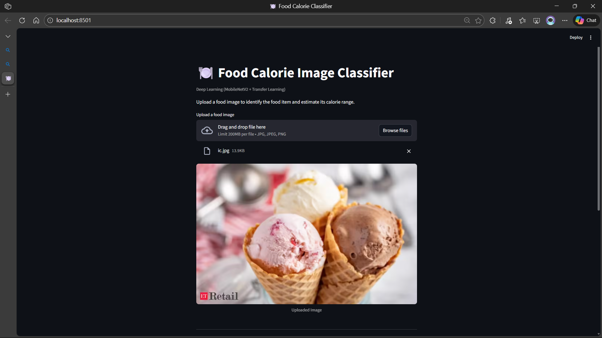
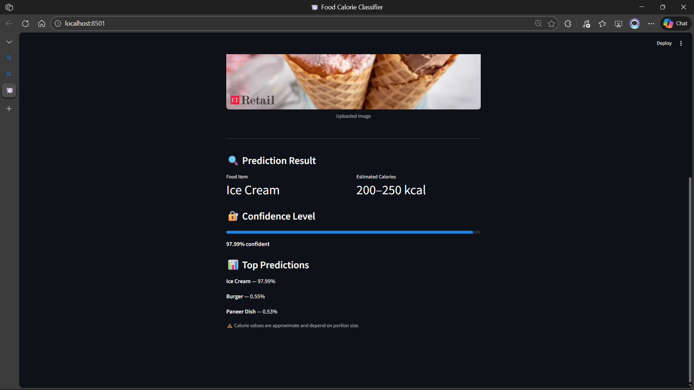

# 🍽️ Food Calorie Image Classifier

**Deep Learning | Computer Vision | Transfer Learning**

A deep learning–based food image classification system that predicts the food item from an image and estimates its calorie range. The project leverages **MobileNetV2 with transfer learning and fine-tuning** , uses a **custom dataset collected via the Unsplash API** , and is deployed using a **Streamlit web application** .

---

## 🚀 Project Overview

This project demonstrates an **end-to-end computer vision pipeline** , covering:

- Dataset creation using the **Unsplash API**
- Image exploration, cleaning, and resizing
- Transfer learning with **MobileNetV2**
- Progressive fine-tuning to improve performance
- Error analysis and class pruning
- Deployment with a clean and interactive **Streamlit UI**

The final application allows users to:

- Upload a food image
- Identify the food category
- View an estimated calorie range
- See the model’s confidence score

---

## 🍔 Final Food Categories

The model is trained on the following **9 food classes** :

- Burger
- Cake
- French Fries
- Ice Cream
- Paneer Dish
- Pasta
- Pizza
- Salad
- Sandwich

---

## 🧠 Model Architecture & Approach

### 🔹 Base Model

- **MobileNetV2** (pretrained on ImageNet)
- Chosen for its lightweight architecture and fast inference

### 🔹 Transfer Learning Strategy

1. Loaded MobileNetV2 with frozen convolutional layers
2. Added a custom classification head
3. Trained only the top layers initially

### 🔹 Fine-Tuning

- Gradually unfroze deeper convolutional layers
- Trained with a **low learning rate**
- Used **early stopping** to avoid overfitting

This approach significantly improved validation accuracy and generalization.

---

## 📊 Model Training & Fine-Tuning Results

| Stage                                | Epochs | Train Accuracy | Validation Accuracy | Validation Loss |
| ------------------------------------ | ------ | -------------- | ------------------- | --------------- |
| Initial Training (Frozen Backbone)   | 10     | ~52%           | ~69.4%              | 1.20            |
| Fine-Tuning Phase 1                  | 10     | ~58%           | ~76%                | 0.90            |
| Fine-Tuning Phase 2 (Early Stopping) | 30     | **~97.7%**     | **~97.2%**          | **0.11**        |

---

## 🧪 Dataset Creation (Unsplash API)

### 🔹 Motivation

Instead of using large-scale food datasets (e.g., Food-101), a **small, curated dataset** was intentionally created to balance **model performance, training speed, and hardware constraints** . Large datasets require significant compute and memory resources, which can slow experimentation and fine-tuning on limited hardware. By leveraging **transfer learning** , high accuracy was achieved even with a compact dataset.

---

### 🔹 Data Collection Pipeline

A **custom automated data ingestion pipeline** was implemented to programmatically collect images using the **Unsplash API** .

- Images are downloaded directly via API calls
- Each food category is stored in a dedicated directory
- Data is split into **training** and **validation** sets at download time
- Invalid or corrupted images are automatically skipped

This pipeline is implemented through a reusable Python module (`data_loader.py`), enabling **easy regeneration or extension of the dataset** without manual intervention.

---

### 🔹 Dataset Characteristics

- **Source:** Unsplash (real-world, diverse images)
- **Classes:** 9 food categories
- **Structure:** Folder-based labeling (`train/` and `val/`)
- **Preprocessing:** Image resizing and cleaning performed before training

---

### 🔹 Design Trade-offs

- ✅ Faster training and iteration
- ✅ Lower hardware and memory requirements
- ✅ Easier debugging and fine-tuning
- ❌ Fewer total samples compared to large public datasets

This trade-off was mitigated by using a pretrained CNN backbone and fine-tuning selected layers, resulting in strong generalization performance.

---

### 🔹 Reproducibility

Because the dataset is generated programmatically, the entire data collection process is:

- **Reproducible**
- **Scalable**
- **Independent of manual downloads**

Any user can recreate or expand the dataset by configuring the data loader with their own Unsplash API key.

### 🔹 Key Benefits

- Clean and diverse images
- Full control over class balance
- Real-world data sourcing

The dataset download process was automated using a Python script with:

- `requests`
- `Pillow`
- Unsplash Search API with pagination support

---

## 📁 Project Structurefood-calorie-classifier/
```
food-calorie-image-classifier/
|
|-- data/
|   |-- raw/
|   |-- processed/
|
|-- notebooks/
|   |-- 01_data_exploration.ipynb
|   |-- 02_model_training.ipynb
|
|-- models/
|   |-- mobilenet_food_classifier.h5
|
|-- data_loader.py
|-- app.py
|-- requirements.txt
|-- README.md
|-- .gitignore
``` 
## 🖥️ Streamlit Application

### 🔹 Features

- Image upload support (JPG / PNG)
- Real-time food classification
- Estimated calorie range display
- Model confidence bar
- Top-3 prediction probabilities

### ▶️ Run the App Locally

```bash
streamlit run app.py
```

---

## ⚠️ Disclaimer

Calorie values are **approximate** and may vary based on portion size, ingredients, and preparation method.
This application is intended for **educational and demonstration purposes** .

---

## 📷ScreenShots






## 🧠 Key Learnings

- Transfer learning is highly effective for small datasets
- Fine-tuning depth and learning rate significantly impact performance
- Error analysis and class pruning improve model reliability
- End-to-end ML projects require both **engineering decisions** and **model evaluation**

---

## 📌 Technologies Used

- Python
- TensorFlow / Keras
- MobileNetV2
- OpenCV
- Streamlit
- Unsplash API
- NumPy, Matplotlib, Pillow

---

## 📈 Future Improvements

- Add portion size estimation
- Extend dataset with more food categories
- Deploy model using Docker
- Integrate nutrition APIs for precise calorie estimation

---

## 👤 Author

**Kandarp Joshi**📍 India

AI & Data Science Developer

🌐 Github: [@Kandarp Joshi](https://github.com/KandarpJoshi1112)
🔗 LinkedIn: [@Kandarp Joshi](https://www.linkedin.com/in/kandarp-joshi-3451231bb/)
